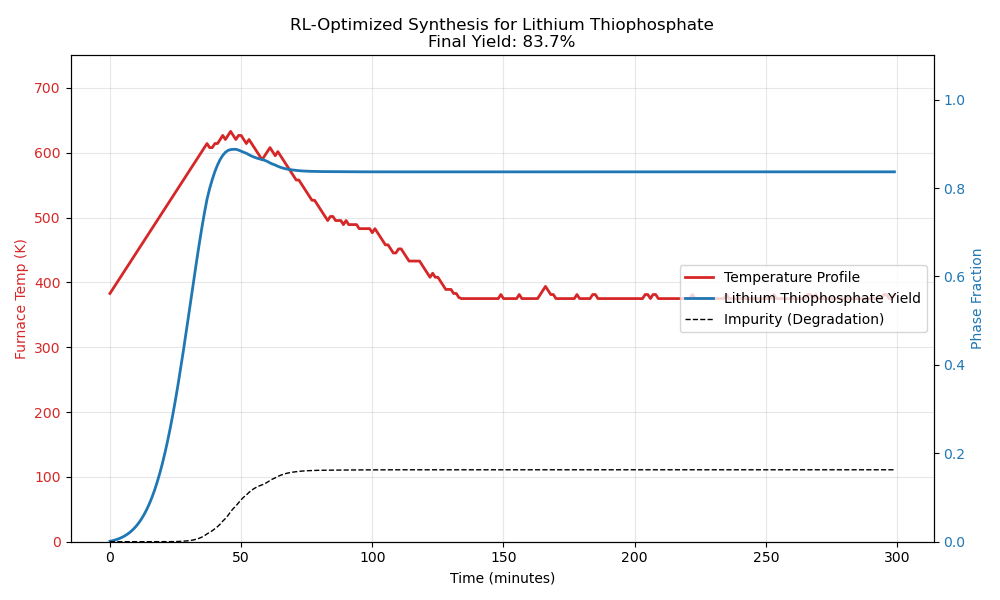

# Autonomous Synthesis of Solid-State Electrolytes

  

**Project AUERLIUS-2** is a specialized reinforcement learning module designed to solve the "Metastable Trap" problem in materials science. It autonomously discovered a non-intuitive heating protocol to synthesize **$\beta-Li_3PS_4$**, a superionic conductor for solid-state batteries, achieving **83.7% purity**.

---

## ⚡ The Challenge: Polymorph Selection

Unlike standard synthesis, optimizing for **$\beta-Li_3PS_4$** is a race against thermodynamics.
* **Target:** $\beta$-phase (Metastable, High Conductivity).
* **Impurity:** $\gamma$-phase (Stable, Low Conductivity).
* **The Trap:** Heating too much or for too long causes the desirable $\beta$-phase to collapse into the useless $\gamma$-phase.

The AI had to learn to "freeze" the atoms in a high-energy state without letting them relax.

---

## 🤖 The Solution: The "Delta-Judge" Agent

We built a custom RL environment that simulates the competitive kinetics of polymorph transformation.

* **Physics Engine:** Calibrated to literature values for solvent-assisted synthesis.
* **Reward Shaping:** We implemented a **"Delta-Judge"** system that applies immediate penalties proportional to the *rate* of degradation. This taught the agent that "Overcooking = Pain."

---

## 🍳 The Discovery: "Spike, Stabilize, Anneal"

Human literature typically suggests a constant soak at 180°C. The AI discovered a more aggressive, **dynamic thermal profile** that outperforms static heating.

**The AI-Optimized Recipe:**
1.  **Nucleation Spike (~620 K / 347°C):** Rapid initial heating to overcome the nucleation barrier and kickstart the reaction.
2.  **Stabilization Quench (500 K / 227°C):** Sharp cooling immediately after the spike to drop below the $\gamma$-transition threshold.
3.  **Annealing Taper (500 K $\to$ 380 K):** Gradual cooling over 3 hours to "soft land" the lattice and lock in the metastable structure.

**Final Yield:** **83.7%** (vs. ~60-70% for standard unoptimized heating).

 
---

## 📊 Results Summary

| Metric | Value | Notes |
| :--- | :--- | :--- |
| **Target Material** | $\beta-Li_3PS_4$ | Solid State Electrolyte |
| **Final Purity** | **83.7%** | High Phase Purity |
| **Max Temp Reached** | 620 K | During Nucleation Spike |
| **Dominant Strategy** | Two-Step Sintering | Discovered Autonomously |

---

## 🔮 Future Work
* **Battery Integration:** Simulate the interface stability of this synthesized electrolyte against a Lithium Metal Anode (**in progress**).
* **Doping Strategy:** Use Bayesian Optimization to select dopants (e.g., Iodine) to widen the stability window of the $\beta$-phase.