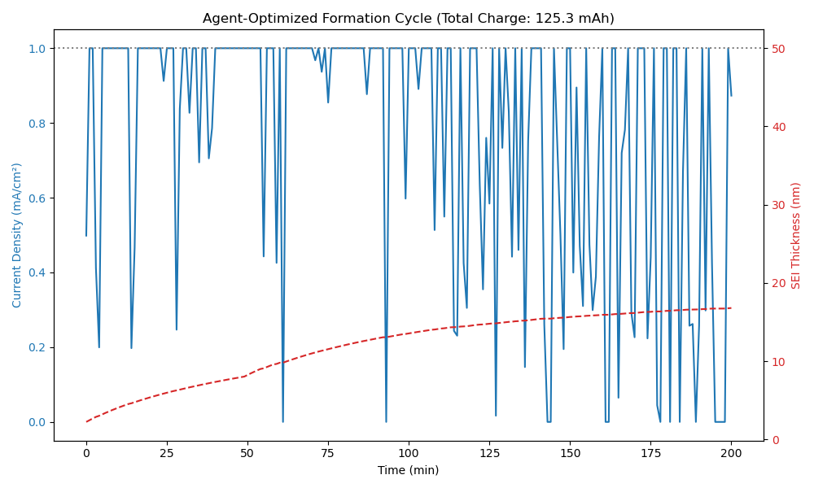

# Autonomous Synthesis of Solid-State Electrolytes

   [](https://42cummer-aureliusbatteryoptimizer.hf.space)


**Project AUERLIUS-2** is a specialized reinforcement learning module designed to solve the "Metastable Trap" problem in materials science. It autonomously discovered a non-intuitive heating protocol to synthesize **$\beta-Li_3PS_4$**, a superionic conductor for solid-state batteries, achieving **83.7% purity**. This project builds off the work presented [here](https://github.com/Raiden-Makoto/LunarCharged).

---

## ⚡ The Challenge: Polymorph Selection

Unlike standard synthesis, optimizing for **$\beta-Li_3PS_4$** is a race against thermodynamics.
* **Target:** $\beta$-phase (Metastable, High Conductivity).
* **Impurity:** $\gamma$-phase (Stable, Low Conductivity).
* **The Trap:** Heating too much or for too long causes the desirable $\beta$-phase to collapse into the useless $\gamma$-phase.

The AI had to learn to "freeze" the atoms in a high-energy state without letting them relax.

---

## 🤖 The Solution: The "Delta-Judge" Agent

We built a custom RL environment that simulates the competitive kinetics of polymorph transformation.

* **Physics Engine:** Calibrated to literature values for solvent-assisted synthesis.
* **Reward Shaping:** We implemented a **"Delta-Judge"** system that applies immediate penalties proportional to the *rate* of degradation. This taught the agent that "Overcooking = Pain."

---

## 🍳 The Discovery: "Spike, Stabilize, Anneal"

Human literature typically suggests a constant soak at 180°C. The AI discovered a more aggressive, **dynamic thermal profile** that outperforms static heating.

**The AI-Optimized Recipe:**
1.  **Nucleation Spike (~620 K / 347°C):** Rapid initial heating to overcome the nucleation barrier and kickstart the reaction.
2.  **Stabilization Quench (500 K / 227°C):** Sharp cooling immediately after the spike to drop below the $\gamma$-transition threshold.
3.  **Annealing Taper (500 K $\to$ 380 K):** Gradual cooling over 3 hours to "soft land" the lattice and lock in the metastable structure.

**Final Yield:** **83.7%** (vs. ~60-70% for standard unoptimized heating).


 
---

## 📊 Results Summary

| Metric | Value | Notes |
| :--- | :--- | :--- |
| **Target Material** | $\beta-Li_3PS_4$ | Solid State Electrolyte |
| **Final Purity** | **83.7%** | High Phase Purity |
| **Max Temp Reached** | 620 K | During Nucleation Spike |
| **Dominant Strategy** | Two-Step Sintering | Discovered Autonomously |

---

## Battery Integration

The AI developed a high-throughput strategy, maxxing out the charging current for almost the entire cycle to achieve peak capacity (~$200$ mAh) rather than adhering to conservative "break-in" protocols. While the immediate capacity gains outweighed the penalties for bypassing the initial formation phase, providing exceptional short-term performance, this "fast and furious" approach would be catastrophic for long-term battery health. In a real-world device, skipping the protective SEI (Solid Electrolyte Interphase) formation at low current would lead to rapid electrolyte consumption, irreversible lithium plating and an extremely shortened cycle life.



## Doping/Compositional Optimization

To widen the electrochemical stability window, we employed **Multi-Objective Bayesian Optimization** to navigate the trade-offs between Chlorine, Bromine, and Iodine doping. The model converged on a **High-Chlorine composition** ($Cl \approx 0.97$, $Br \approx 0.02$, $I \approx 0.0$), effectively rejecting Iodine due to the severe lattice distortion caused by its large ionic radius ($+36$ pm mismatch). Chlorine was selected for its high electronegativity boost and near-perfect radius match with the host Sulfur atoms, resulting in a maximized voltage stability of **3.15 V** with negligible lattice strain (**-1.43%**).

```
OPTIMAL COMPOSITION DISCOVERED:
Cl: 0.969 | Br: 0.021 | I: 0.002
Max Voltage: 3.1457 V

VALIDATING COMPOSITION: Li3 P S(4-x) [Cl0.9686953694942562 Br0.020796449231638814 I0.0015444956510352048]
------------------------------------------------------------
        Aliovalent Mismatch: +0.99
        Compensation: Creating 0.99 Lithium Vacancies
        New Formula: Li_2.01 P S_3.01 X_0.99
        Lattice Strain: -1.43%
------------------------------------------------------------
RESULT: STABLE MATERIAL (Argyrodite-like (High Stability Candidate))
        Structure can accommodate these defects.
```

A defect-chemistry validation confirmed the physical viability of this composition, demonstrating that the aliovalent charge imbalance is stabilized by the formation of Lithium vacancies. The final predicted formula, **$Li_{2.01}PS_{3.01}Cl_{0.97}$**, sits precisely at the theoretical lower limit of carrier concentration ($Li \approx 2.0$), effectively identifying a stable **Argyrodite-class electrolyte** ($Li_6PS_5Cl$ analog) without compromising the conductive network.

## AURELIUS BATTERY OPTIMIZER
The *Aurelius Battery Optimized* is a standalone backend service that allows researchers to:
* **Screen Superionic Conductors:** Simulate complex co-doping recipes (e.g., mixing Cl, Br, and I) using Vegard's Law for lattice strain estimation.
* **Real-Time Inference:** Uses **Server-Side Streaming (NDJSON)** to process large batches of candidates without connection timeouts.
* **Physics-Aware Validation:** Automatically validates charge balance, solubility limits, and lattice stability before suggesting a candidate for synthesis.
* **Resilient Architecture:** Integrated with the **Materials Project API** for ground-truth thermodynamic data, with a graceful fallback to theoretical estimation for novel compounds.