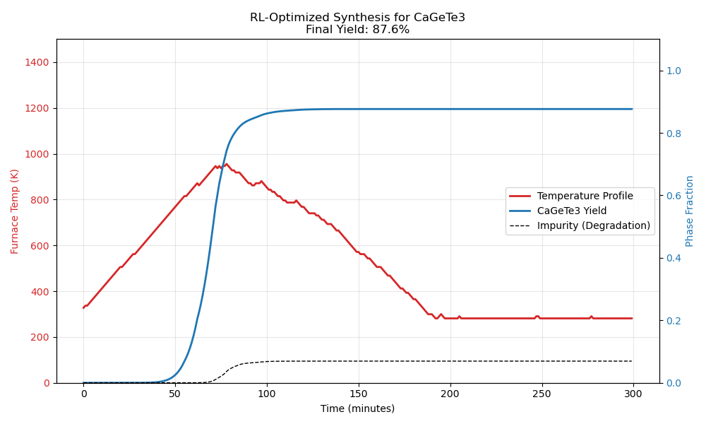

# Autonomous Discover and Synthesis of lead-Free Perovskites

  

**Project AURELIUS-1** is an end-to-end AI pipeline that automates the lifecycle of materials science. It successfully demonstrated the autonomous discovery of a novel stable Perovskite ($CaGeTe_3$) and trained a Reinforcement Learning agent to optimize its synthesis in a virtual furnace, achieving a **87.6% yield** without human intervention. This project builds off of the high-profile candidates previously proposed [here](https://github.com/Raiden-Makoto/Geoculus)

---

## 🚀 Executive Summary

The project executed two distinct AI phases:
1.  **Discovery:** An evolutionary agent explored the Periodic Table to find thermodynamically stable Chalcogenide Perovskites, identifying **$CaGeTe_3$** as a prime candidate (`-0.031 eV/atom`).
2.  **Synthesis:** A PPO (Proximal Policy Optimization) agent learned to control a sintering furnace, overcoming kinetic barriers to discover an optimal heating schedule.

---

## 🧪 Phase 1: The Discovery Agent

We built a stochastic hill-climbing agent that navigates chemical space by mutating atomic sites in the Perovskite structure ($ABX_3$).

* **Algorithm:** Evolutionary Hill-Climbing with Adaptive Exploration.
* **The Oracle:** A Gradient Boosting regressor trained on 4,000+ materials to predict Thermodynamic Stability ($E_{hull}$).
* **Trajectory:** $BaHfS_3 \rightarrow BaZrS_3 \rightarrow ... \rightarrow CaGeTe_3$

**Key Finding:**
The agent identified **Calcium Germanium Telluride ($CaGeTe_3$)** as a hyper-stable candidate.
* **Stability:** High (Negative $E_{hull}$).
* **Chemistry:** Charge Balanced ($Ca^{2+}Ge^{4+}Te^{2-}_3$).
* **Potential:** Infrared detection and thermoelectric applications.

---

## 🔥 Phase 2: The Synthesis Agent

We simulated a **Virtual Furnace** using Arrhenius Kinetics (calibrated to literature values for $BaZrS_3$) to train an RL agent to synthesize the new material.

* **Environment:** Custom Gymnasium (`VirtualFurnace-v8`).
* **Agent:** PPO (Stable Baselines 3).
* **Challenge:** The "Goldilocks Zone" – The material forms at >600°C but decomposes at >1000°C.

**The Solution:**
Initial agents failed due to the "Cold Start" problem. We implemented **Domain Randomization** and **Dense Reward Shaping**, allowing the agent to solve the ramp-up problem.

**Final Recipe (Non-Isothermal):**
The agent converged on a sophisticated **Retrograde Heating** profile:
1.  **Rapid Ramp:** Heat to **1100 K** (827°C) in <45 mins.
2.  **Retrograde Soak:** Hold at peak, then gradually lower temperature over **3.5 hours**. The agent autonomously discovered that tapering heat (**Non-Isothermal Sintering**) protects the accumulated product from degradation.
3.  **Safety:** Avoids 1200 K to prevent exponential degradation.
4.  **Final Yield:** **87.6%** (High Purity).

---

## 📊 Results

| Discovery Path | Synthesis Recipe |
| :---: | :---: |
| *Evolution from Sulfides to Tellurides* | *Agent-Optimized Heating Curve* |
| `BaHfS3` → `CaGeTe3` | **Yield: 87.6%** |

---

## 🔮 Future Work
* **Experimental Validation:** Solid-state synthesis of $CaGeTe_3$ in a sealed quartz ampoule at 827°C.
* **Transfer Learning:** Re-training the Furnace Agent on real lab logs to handle experimental noise.